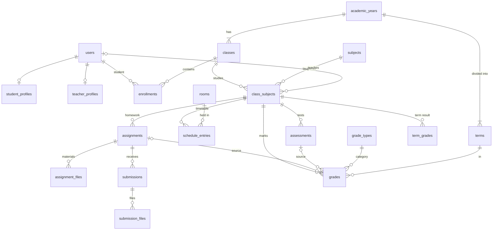

# Gjimnazi “Kuvendi i Arbërit” — LMS Architecture

> Status: **v1 plan** · written 26 Sep 2026 · companion to [ROADMAP.md](ROADMAP.md)
> Database: [`database/schema.sql`](../database/schema.sql) (verified on MariaDB 10.4) · reference data: [`database/seed.sql`](../database/seed.sql)

---

## 1. What we are building

One codebase, one database, one design language — two faces:

1. **Public school website.** Editorial in feel: Ballina, Rreth nesh, Lajme, Programet, Stafi, Pyetje të shpeshta and Kontakti. It naturally leads into the portal.
2. **LMS portal.** Three role-specific workspaces (Nxënës, Mësimdhënës, Administrator) that share components but show each role only what it needs.

**Guiding principles**

- **Functional before decorative.** Every screen we build performs its action against MySQL end to end. No mock pages.
- **School data lives in the database.** Nothing school-specific is hard-coded in PHP: names, contact details, subjects, bell times and texts are all in the DB.
- **Security is centralised.** Access checks, CSRF protection and escaping happen in one place by default, so no page has to remember to add them.
- **Plain, readable PHP.** No framework and zero Composer dependencies: a small core of ~10 classes that any PHP developer can read in an afternoon.
- **One language.** All UI copy is in Albanian and follows a single glossary (§12).

---

## 2. Environment & stack

| Layer | Choice | Notes |
|---|---|---|
| Server | Apache 2.4 (XAMPP at `C:\xampp_ick`) | `mod_rewrite` + `mod_headers` loaded, `AllowOverride All` → clean URLs via `.htaccess` |
| Language | PHP 8.2.12 | `pdo_mysql`, `mbstring`, `fileinfo`, `openssl` available; `gd`/`intl` **off**, so we don't depend on them (Albanian date formatting is our own helper) |
| Database | MariaDB 10.4.32 (MySQL-8 compatible schema) | DB `kuvendi_lms`, utf8mb4 / `utf8mb4_unicode_ci`, InnoDB |
| DB access | PDO only | `ERRMODE_EXCEPTION`, `EMULATE_PREPARES=false`, `FETCH_ASSOC`, prepared statements everywhere |
| Front end | Server-rendered PHP views + hand-written CSS + small vanilla JS modules | No CSS framework: the design system is ours (§11) |
| Time zone | `Europe/Belgrade` (Kosovo) | PHP sets it; the PDO connection sets MySQL `time_zone` to the same offset so `NOW()` and PHP agree |
| URL | `http://localhost/lms-system/` in dev | Base path comes from config, so the app also works at a domain root in production |

**Why no framework?** You asked for PHP + MySQL + PDO, and a maintainer should be able to follow a request from URL to SQL without learning Laravel first. The tiny core (router, request, view, DB, session, CSRF, auth, validator, upload) is ordinary code in `app/Core/`.

---

## 3. Project structure

```
lms-system/
├── .htaccess                  # sends every request into public/; denies app/, config/, database/, storage/, docs/
├── public/                    # ← the ONLY web-reachable directory
│   ├── index.php              # front controller (every page goes through here)
│   ├── .htaccess              # real files are served; everything else → index.php
│   ├── assets/
│   │   ├── css/               # tokens.css, base.css, components/*.css, public.css, portal.css
│   │   ├── js/                # app.js + small modules (nav, tabs, confirm, file-input, reveal)
│   │   ├── img/               # logo mark (SVG), school photography
│   │   └── fonts/             # self-hosted web fonts (no third-party requests)
│   └── uploads/               # PUBLIC uploads only: post covers, staff photos, avatars
├── app/
│   ├── bootstrap.php          # autoloader, config, error handling, session, headers
│   ├── routes.php             # every route in one file, grouped by role
│   ├── Core/                  # Router, Request, Response, View, Database, Session, Csrf,
│   │                          # Auth, Validator, Upload, Flash, Logger
│   ├── Middleware/            # Authenticate, RequireRole, VerifyCsrf, GuestOnly
│   ├── Controllers/
│   │   ├── Site/              # public website pages
│   │   ├── Auth/              # login, logout, password change (no sign-up)
│   │   ├── Student/
│   │   ├── Teacher/
│   │   └── Admin/
│   ├── Models/                # ALL SQL lives here (one class per aggregate: User, SchoolClass, Assignment …)
│   ├── Services/              # logic spanning models: GradeCalculator, ScheduleService,
│   │                          # NotificationService, FileStorage, PostFormatter, Slugger
│   ├── Policies/              # ownership checks: can this teacher open this class-subject? …
│   ├── Support/               # helpers.php (e(), url(), asset(), sq_date() …), Labels.php (Albanian enums)
│   └── Views/
│       ├── layouts/           # site.php, auth.php, portal.php
│       ├── partials/          # header, footer, sidebar, flash, pagination, empty-state, icons
│       ├── site/  auth/  student/  teacher/  admin/  errors/
├── config/
│   ├── config.php             # defaults, reads config.local.php
│   └── config.local.example.php   # copy → config.local.php (DB credentials, base URL, env) — never committed
├── database/
│   ├── schema.sql             # tables (this plan)
│   ├── seed.sql               # reference data
│   ├── demo/                  # demo school for testing (later task)
│   └── migrations/            # numbered changes after launch
├── storage/                   # PRIVATE, never web-reachable
│   ├── uploads/assignments/   # teacher materials
│   ├── uploads/submissions/   # student work
│   └── logs/
└── docs/                      # ARCHITECTURE.md, ROADMAP.md, later TESTING.md, DEPLOYMENT.md
```

**Rules that keep it maintainable**

- One route maps to one controller method. Controllers stay thin: validate the input, call models/services, render a view.
- **SQL only in `Models/`.** Views never query and never echo raw data: everything goes through `e()`.
- CSS is split by responsibility (tokens → base → components → page-level). No inline styles, which also keeps the Content-Security-Policy strict.
- Albanian enum labels (statuses, days, grade words) come from `Support/Labels.php`, so "E dorëzuar" is spelled the same everywhere.

---

## 4. Request lifecycle

```
Browser ─► /.htaccess ─► public/index.php ─► app/bootstrap.php
                                               │ config, autoload, error handler,
                                               │ secure session, security headers
                                               ▼
                                            Router  (method + path → route)
                                               │
                           middleware chain per route group
          [VerifyCsrf on POST] → [Authenticate] → [RequireRole:teacher] → …
                                               │
                                               ▼
                         Controller ─► Policy (owns this ID?) ─► Model / Service ─► PDO
                                               │
                                               ▼
                         View (layout + partials, escaped output) ─► Response
```

Errors never leak stack traces in production: they are logged to `storage/logs/` and shown as friendly Albanian pages (403, 404, 419 "session expired", 500).

---

## 5. Roles & permissions

### 5.1 Role model

Every account has exactly one role: `student`, `teacher` or `admin` (`users.role`).

- **Every account is created by the school.** There is **no public sign-up**: the website only offers *Hyr*. See §6.1.
- **Account status:** `active` · `inactive` (deactivated: can't log in, but all history is kept).

### 5.2 Two layers of authorization (why changing the URL doesn't work)

1. **Route guard (role).** Every route under `/nxenesi/*` requires `student`, `/mesimdhenesi/*` requires `teacher` and `/admin/*` requires `admin`. The guard is attached to the route *group* in `routes.php`, so a new page cannot forget it. A student who types `/admin/...` gets **403**.
2. **Ownership (object level).** Each ID in a URL is checked against the logged-in user by a policy:
   - a **teacher** may open a class-subject only if `class_subjects.teacher_id = me`. The same applies to its assignments, assessments, submissions and grades.
   - a **student** may open an assignment only if it belongs to a class-subject of **their** class this year. They can see only **their own** submission, grades and files.
   - Failure returns **404**, not 403, so the system doesn't reveal that the object exists.
3. **Files** are never linked directly. `/skedari/{lloji}/{id}` streams a file only after the same ownership check.

The user is re-loaded from the database on every request. Deactivating an account or changing its role therefore takes effect immediately, not at the next login.

### 5.3 Permission matrix

| Capability | Nxënës | Mësimdhënës | Admin |
|---|:-:|:-:|:-:|
| View own dashboard, profile; change own password | ✅ | ✅ | ✅ |
| View own class timetable | ✅ | — | — |
| View own teaching timetable | — | ✅ (read-only) | — |
| Edit timetable & bell schedule | — | — | ✅ all |
| View class subjects & teachers | own class | classes they teach | all |
| See student lists | — | classes they teach | all |
| Create / edit / publish assignments | — | own class-subjects | ✅ all (oversight) |
| Submit / resubmit homework | own, while allowed | — | — |
| View submissions | own | for own assignments | all |
| Review: feedback, grade, return for revision | — | own assignments | ✅ |
| Create assessments (tests, exams…) & enter results | — | own class-subjects | ✅ |
| Enter manual marks, set term grades | — | own class-subjects | ✅ (logged) |
| View grades & averages | own | own class-subjects | all |
| Announcements | read (for their audience) | create for classes they teach | create for anyone |
| Public posts / news | read (public site) | read | ✅ create / edit / delete |
| Manage users, roles, status, passwords | — | — | ✅ |
| Manage years, terms, subjects, rooms, classes, enrollments | — | — | ✅ |
| School information, FAQ, links, settings | — | — | ✅ |
| Contact inbox, activity log, statistics | — | — | ✅ |

---

## 6. Authentication & sessions

### 6.1 Account creation (no self sign-up)

The school issues every account; the public site has **Hyr** only.

- **Students** are created by the admin, either one at a time or by **CSV import into a class**: *emri, mbiemri*, plus optional e-mail and student number. The import enrols each student into the class for the current year.
- **Teachers and admins** are created one at a time by an admin.
- **Credentials.** For every new account the system generates:
  - a **username** from the name, lowercase and without diacritics (*Arta Gashi* → `arta.gashi`, then `arta.gashi2` on a clash). Students don't need an e-mail address to use the platform.
  - a readable **temporary password** (e.g. `lule-7-mali-42`), with `must_change_password = 1`.
- **Handing credentials over.** Right after creation or import, the admin gets a **printable page of credential slips**, one per student, for the homeroom teacher to hand out. Passwords are stored only as hashes, so this page is shown **once**. Reprinting later means issuing a new temporary password, which also invalidates the old slip.
- **First login.** The student must choose their own password before they can continue.
- **Delivery by e-mail** is possible later, once the school provides an SMTP account.

### 6.2 Login & passwords

- **Login.** The user signs in with their **username or e-mail** and password. On failure they always see the same message, *"Emri i përdoruesit ose fjalëkalimi është i pasaktë."*, so the form doesn't reveal which accounts exist.
- **Hashing.** Passwords are stored with `password_hash()` (`PASSWORD_DEFAULT`) and checked with `password_verify()`. `password_needs_rehash()` upgrades old hashes transparently.
- **Password rules.** At least 8 characters, not equal to the username or e-mail, different from the temporary password, and the confirmation must match.
- **Brute-force protection** (`login_attempts`): ≥ 5 failures for one identifier, or ≥ 20 from one IP, within 15 minutes → temporary lock with a clear message.
- **Forgotten password.** The admin issues a new temporary password (a new slip). E-mail-based reset is a later option, once the school has SMTP.
- **Inactive accounts** cannot log in; they see an explanatory message.

### 6.3 Sessions

- Custom session name, `use_strict_mode=1`, `use_only_cookies=1`, and cookie flags `HttpOnly`, `SameSite=Lax`, and `Secure` when served over HTTPS.
- `session_regenerate_id(true)` runs on login, on logout and on any privilege change.
- Idle timeout is 60 minutes, which matters on shared school computers; the absolute session lifetime is 12 hours.
- Logout is a **POST** request with a CSRF token, and the session plus its cookie are destroyed.

### 6.4 CSRF

Each session has a token (`random_bytes(32)`). Every form carries it as a hidden `_token` field. The router rejects any POST whose token doesn't match (`hash_equals`), and shows a friendly "session expired" page: "Sesioni ka skaduar…". Internally this is status 419, but it is sent as **403**, because Apache turns non-standard codes into 500. A POST larger than `post_max_size` gets a clear 413 page instead of a misleading "session expired". Nothing changes state on GET.

---

## 7. Database design

30 tables and 44 foreign keys, verified by importing into MariaDB and running 13 negative tests (§7.4).

### 7.1 Core relationships



### 7.2 Table catalogue

| Area | Tables |
|---|---|
| Configuration | `settings` |
| People | `users`, `student_profiles`, `teacher_profiles` |
| Calendar | `academic_years`, `terms` |
| Structure | `subjects`, `rooms`, `lesson_periods`, `classes`, `enrollments`, `class_subjects`, `schedule_entries` |
| Coursework | `grade_types`, `assignments`, `assignment_files`, `submissions`, `submission_files`, `assessments`, `grades`, `term_grades` |
| Communication | `post_categories`, `posts`, `announcements`, `notifications` |
| Public content | `contact_messages`, `faqs`, `useful_links` |
| Audit & security | `activity_log`, `login_attempts` |

### 7.3 Key design decisions

1. **`class_subjects` is the hub.** "Matematikë in X-1, taught by Prof. Krasniqi" is one row. Assignments, tests, marks and timetable slots all point at it. If the teacher changes mid-year, the new teacher inherits the full history of that class-subject.
2. **`enrollments` per academic year**, not a `class_id` on the student. This keeps last year's class and grades intact. The end-of-year promotion (X-1 → XI-1) becomes a simple insert for the new year.
3. **Homework ≠ tests.** `assignments` are handed in through the platform (with files); `assessments` are tests, exams and oral answers that happen in class and whose results the teacher types in. Both feed the **single `grades` table**, along with manual marks.
4. **Every mark is 1–5** (the Kosovo scale), enforced by a CHECK constraint. Optional raw `points` are stored when a test has a points scale. The admin-editable `grade_thresholds` (default 50/65/80/90 %) *suggest* a mark from the points, and the teacher can always override.
5. **Averages are computed, the term grade is decided.** The subject average per term is the weighted mean of marks (`Σ grade×weight / Σ weight`, weights from `grade_types`, all 1.00 by default). The teacher then records the **term grade** (`term_grades`) informed by that average, as Kosovo practice requires. Nothing is silently auto-finalised.
6. **Grading is separate from submitting.** A submission's `status` (submitted / returned / reviewed) tracks the conversation; the mark lives in `grades`. This lets a teacher grade a student who never submitted, or give feedback without a mark.
7. **Composite foreign keys keep denormalised columns honest.** For example, a timetable slot's `class_id` must match its class-subject's class, and a mark for assignment #7 must be filed under assignment #7's class-subject.
8. **The timetable uses `period_number` + the class's `shift`**, not a period ID, so the bell schedule can change without breaking the timetable. Teacher and room clashes are checked in `ScheduleService` using **real clock times**, because two classes in different shifts can share a period number at different times.
9. **Deletion policy.** Academic records use `RESTRICT`: a student with marks can't be deleted, only **deactivated**. Purely dependent data (files, profile, notifications) uses `CASCADE`. Removing a teacher sets their class-subjects to "unassigned" (`SET NULL`) and keeps the history.
10. **Files are outside the web root.** Assignment materials and submissions are stored in `storage/` under random names and streamed by PHP after a policy check. Only public images (post covers, staff photos) live in `public/uploads/`.
11. **School information is a key/value `settings` table**, so the admin can edit the name, contact details, about texts and platform switches without a developer.

### 7.4 Verified behaviour

Each of these statements was run against a throwaway copy of the schema. MariaDB rejected every one:

- a timetable slot whose class doesn't match its subject assignment
- two lessons for the same class in the same slot
- a mark of 6
- a mark with two sources at once
- a mark for an assignment filed under another class-subject
- a duplicate mark for the same student and assignment
- a student in two classes in the same year
- an enrollment with the wrong school year
- deleting a student who has marks
- deleting an assignment that has marks
- deleting a subject still taught in a class
- deleting a class that still has students
- a duplicate e-mail differing only in case

Removing a teacher correctly un-assigned them and kept all marks.

---

## 8. Core workflows

**W1 — Admin sets up the school year**
1. Create the year and its terms, then subjects, rooms and teacher accounts.
2. Create the classes (grade, section, stream, shift, homeroom teacher).
3. Inside each class, assign subject → teacher (`class_subjects`).
4. Build the timetable in the grid builder (conflict-checked).

**W2 — Student onboarding**
1. The admin imports a class list (CSV) or adds students one by one. Accounts are created active and enrolled in the class, each with a generated username and temporary password.
2. The admin prints the credential slips; the homeroom teacher hands them out.
3. The student opens *Hyr*, signs in with the slip, and is asked to choose their own password.
4. They land on *Paneli* and immediately see today's lessons, their subjects and teachers.

**W3 — Homework loop (the one you described)**
1. The teacher creates an assignment (draft) with a title, description, instructions, deadline and files, then publishes it. Every student in the class gets a notification.
2. The student opens it and submits text and/or files. Status becomes **E dorëzuar**, or **Me vonesë** if late and late submissions are allowed.
3. The teacher opens the assignment and sees **all students in one table**: submitted / late / missing.
4. The teacher opens a submission and either:
   - gives **feedback + a mark** (points → suggested mark), which sets the status to **E vlerësuar**, or
   - **returns it for revision**, which sets **Kthyer për përmirësim**; the student can then resubmit.
5. The student is notified and sees the mark and the feedback. The mark also appears in *Notat* and in the subject average.

**W4 — Test**
1. The teacher schedules an assessment (type, date, optional points). It appears in the students' *Vlerësimet e ardhshme* and on their dashboard.
2. After the test, the teacher enters every result in one grid.
3. Students are notified.

**W5 — Closing a term.** The teacher opens the grade book (*Ditari i notave*) and sees the weighted average per student, then sets the term grades. Students see them on *Notat*, along with their overall average.

**W6 — News.**
1. The admin writes a post (category, cover, featured flag) and saves it as a draft.
2. On publishing, it appears on the home page and on *Lajme*; featured posts lead the "Në fokus" slot.

**W7 — Announcements.** Admins post to everyone, students, teachers or one class; teachers post to classes they teach. Announcements appear on the relevant dashboards until they expire. Pinned ones stay on top.

**W8 — End of year** (later task). Create the next year, copy the class structure one grade up, promote the enrollments, and archive the old year (read-only).

---

## 9. Feature specifications

### 9.1 Timetable (Orari)

**Student view:**
- Desktop: a week grid with days as columns and periods as rows, times shown.
- Phone: day tabs with today pre-selected, e.g. *E premte* → Ora · Lënda · Mësimdhënësi · Salla.
- The current lesson is highlighted, and there is a "Tani / Në vazhdim" (now / next) card.

**Teacher view:** their week across all classes, **read-only**. The timetable belongs to the administration.

**Admin view:**
- A grid builder per class: click a cell, then pick the subject and room.
- A bell-schedule editor for **both shifts** (morning and afternoon).
- A **conflict report** (class slot taken, teacher double-booked, room double-booked).
- A planned-vs-scheduled weekly hours check.
- When a class's timetable changes, its students get a notification.

**Shifts.** Each class belongs to one shift, and lesson times come from that shift's bell schedule. If classes switch shifts during the year (e.g. per semester), the admin only changes the class's shift: the timetable keeps its periods and the times follow automatically.

### 9.2 Assignments & submissions

- **Fields:** title, description, optional instructions, subject + class (a class-subject), deadline, category (homework / project), optional points, accept-late flag, attachments.
- **Uploads:**
  - Allowed extensions: pdf, doc(x), ppt(x), xls(x), odt, txt, jpg, png, zip.
  - The MIME type is verified with `finfo` against the extension.
  - Default limit is 10 MB per file (`upload_max_mb`), max 5 files.
  - Files get random stored names and never execute.
- **Student-facing statuses:**
  - *E re* — not opened or not submitted yet
  - *E dorëzuar* — submitted
  - *Me vonesë* — submitted late
  - *Kthyer për përmirësim* — returned for revision
  - *E vlerësuar* — reviewed
  - *Afati ka kaluar* — deadline passed without a submission
- **Resubmission:** allowed until the deadline while the submission is not yet reviewed, and at any time after it is returned.

### 9.3 Grades (Notat)

- **Scale:** 5 *Shkëlqyeshëm* · 4 *Shumë mirë* · 3 *Mirë* · 2 *Mjaftueshëm* · 1 *Pamjaftueshëm*.
- **Student *Notat* page:** per subject, the marks as chips grouped by term (hover or tap shows what each mark was for), the weighted average (shown with a decimal comma, e.g. **4,25**), the term grade once set, and the overall average.
- **Teacher grade book:** a students × marks grid for one class-subject, with the average column, term-grade entry and quick manual-mark entry (e.g. *Përgjigje me gojë*).
- **Admin:** can correct any mark. Every correction records `updated_by` and writes an `activity_log` entry.

### 9.4 Public posts

- **Body format:** a small, safe markup covering paragraphs, `## headings`, **bold**, *italic*, lists, quotes and links. It is rendered by our own `PostFormatter`, which escapes everything first, so **no raw HTML is ever stored or echoed**.
- **Cover image:** jpg / png / webp up to 5 MB, validated with `getimagesize()`, random filename.
- **Slugs** are made from the title with Albanian transliteration (ë→e, ç→c), e.g. `/lajme/dy-nxenes-fitojne-hackathonin-kombetar`.
- **Categories:** *Lajme · Arritje · Aktivitete · Shpallje*. The featured flag puts a post in "Në fokus".

### 9.5 Announcements & notifications

**Announcements** (*Njoftime*) are posts inside the portal, targeted by audience (everyone, students, teachers or a single class).

**Notifications** (*Lajmërime*, the bell) are personal. They are created for these events:

| Event | Who is notified |
|---|---|
| Assignment published | students of that class |
| Submission reviewed or returned | the student |
| New mark (test or manual) | the student |
| Timetable changed (by the admin) | students of that class |

Unread counts appear in the top bar. Contact-form messages show as a count on the admin dashboard rather than as notifications.

### 9.6 Public website pages

All content comes from the DB:

| Page | Content source |
|---|---|
| **Ballina** | hero (school photo + motif), "Në fokus" story, latest news, school in numbers (live counts), programmes, achievements, principal's message, a path into the portal |
| **Rreth nesh** | settings texts |
| **Lajme** | list, category and article views |
| **Programet** | subjects and streams |
| **Stafi** | teachers with `show_on_website` |
| **Pyetje të shpeshta** | `faqs` |
| **Kontakti** | details + map link + form → `contact_messages` (honeypot + rate limit) |
| **Useful links** | shown in the footer |

---

## 10. URL map

URLs are Albanian (without diacritics); code identifiers are English.

**Public & shared**

| Method | Path | Page |
|---|---|---|
| GET | `/` | Ballina |
| GET | `/rreth-nesh` · `/programet` · `/stafi` · `/pyetje-te-shpeshta` | static-ish pages from DB |
| GET | `/lajme` · `/lajme/kategoria/{slug}` · `/lajme/{slug}` | news |
| GET/POST | `/kontakti` | contact form |
| GET/POST | `/hyr` | login (guests only; there is no sign-up page) |
| POST | `/dil` | logout |
| GET/POST | `/ndrysho-fjalekalimin` | forced password change |
| GET | `/paneli` | redirects to the role's dashboard |
| GET/POST | `/profili` | profile, avatar, password |
| GET/POST | `/lajmerimet` | notifications, mark as read |
| GET | `/skedari/{lloji}/{id}` | authorised file download |

**Student — `/nxenesi`**

| Path | Page |
|---|---|
| `/nxenesi` | Paneli |
| `/nxenesi/orari` | Orari |
| `/nxenesi/lendet` · `/nxenesi/lendet/{id}` | Lëndët · one subject (teacher, homework, marks) |
| `/nxenesi/detyrat` · `/nxenesi/detyrat/{id}` (+ POST `/dorezo`) | Detyrat · detail & submit |
| `/nxenesi/vleresimet` | upcoming tests/exams |
| `/nxenesi/notat` | Notat |
| `/nxenesi/njoftimet` | Njoftimet |

**Teacher — `/mesimdhenesi`**

| Path | Page |
|---|---|
| `/mesimdhenesi` | Paneli |
| `/mesimdhenesi/orari` | Orari (read-only) |
| `/mesimdhenesi/klasat` · `/mesimdhenesi/klasat/{id}` | my class-subjects · overview |
| `/mesimdhenesi/klasat/{id}/ditari` | grade book, manual marks, term grades |
| `/mesimdhenesi/klasat/{id}/nxenesit/{studentId}` | one student's performance |
| `/mesimdhenesi/detyrat` · `/krijo` · `/{id}` · `/{id}/ndrysho` | assignments + submissions table |
| `/mesimdhenesi/dorezimet/{id}` | review a submission |
| `/mesimdhenesi/vleresimet` · `/krijo` · `/{id}/rezultatet` | tests + results grid |
| `/mesimdhenesi/njoftimet` | class announcements |

**Admin — `/admin`**

| Path | Page |
|---|---|
| `/admin` | Paneli |
| `/admin/perdoruesit` (+ `/krijo`, `/{id}/ndrysho`) | all users, status, roles, new temporary password |
| `/admin/nxenesit` · `/admin/mesimdhenesit` | role-filtered views |
| `/admin/nxenesit/importo` | CSV import of a class list |
| `/admin/fletet-e-hyrjes` | one-time printable credential slips (after create / import / reset) |
| `/admin/vitet-shkollore` · `/admin/lendet` · `/admin/sallat` | years & terms · subjects · rooms |
| `/admin/klasat` · `/admin/klasat/{id}` | classes · enrollments, subject/teacher assignment |
| `/admin/orari` · `/admin/orari/oret` | timetable builder · bell schedule |
| `/admin/detyrat` · `/admin/notat` | oversight of assignments · marks |
| `/admin/lajmet` · `/admin/kategorite` | posts · categories |
| `/admin/njoftimet` · `/admin/mesazhet` | announcements · contact inbox |
| `/admin/faqja` · `/admin/cilesimet` | school info, FAQ, links · platform settings & grade weights |
| `/admin/aktiviteti` | activity log |

---

## 11. UI & design system

### 11.1 Reading the logo

The mark is a **solid teal square fractured by three white lines**. The lines cut across the square and meet to form a triangle, reaching all the way to the edges. It is geometric, calm and modern. Read literally, separate lines converge on one shared shape, which is a fitting image for a *kuvend* (an assembly).

The wordmark is a geometric sans: *GJIMNAZI* is light and widely tracked, and *KUVENDI I ARBËRIT* is bold.

That gives the whole identity: **one confident colour, white space, straight lines, geometry.** Everything below is derived from it.

### 11.2 Palette (≈ a dozen tokens, nothing random)

| Token | Hex | Role | Contrast |
|---|---|---|---|
| `--brand` | `#009EB4` | exact logo teal: logo, large display accents, rules, active indicators, focus ring | 3.2:1 on white → **large text/decoration only** |
| `--brand-strong` | `#007A8C` | links, primary buttons (white text), small teal text | 5.0:1 on white ✅ |
| `--brand-deep` | `#00606F` | hover/pressed state of primary | — |
| `--brand-tint` | `#E6F5F7` | highlights: today's lesson, selected rows | — |
| `--ink` | `#0D2530` | deep petrol-blue: body text, dark sections, portal sidebar | 14.8:1 on paper ✅ |
| `--ink-2` | `#34505B` | secondary text | ≈ 8:1 ✅ |
| `--ink-3` | `#5E727B` | meta text, captions | 5.0:1 ✅ |
| `--paper` | `#F8F7F3` | warm off-white page background (editorial "paper") | — |
| `--surface` | `#FFFFFF` | cards, tables, forms | — |
| `--line` | `#E2DFD7` | hairline rules and borders | — |
| `--clay` | `#D2694A` | **secondary accent** from the school building's terracotta facade: editorial kickers, "Në fokus", small highlights on the public site | decorative/large only |
| `--clay-strong` | `#A6482E` | clay as small text | 5.9:1 ✅ |

**Semantic colours** are used only for status, always with an icon and a word, never colour alone: success `#2F7A55`, warning `#9A6A00`, danger `#B3261E`, info = brand.

**Colour rules**
- Teal is the primary colour. Clay appears on **< 5 % of any screen** and **never** in status or feedback UI, so it can't be confused with "danger".
- Teal text on the dark ink background passes (4.9:1), so the brand colour works on both light and dark sections.

### 11.3 Typography

| Use | Face | Why |
|---|---|---|
| Display & headlines, article text | **Newsreader** (serif, optical sizes, true italics) | Built for editorial reading: it gives the "magazine" voice while staying academic rather than fashion |
| UI, navigation, tables, forms, numbers | **Manrope** (geometric sans, tabular figures) | Echoes the logo's geometric wordmark but stays legible in dense dashboards; tabular numbers keep grade columns aligned |

- Fonts are **self-hosted** (no requests to Google at runtime). Both cover ë/ç.
- Type scale (desktop): display 88 / 64 · h1 44 · h2 32 · h3 24 · h4 19 · body 16 (articles 19 serif) · small 14 · kicker 12.
- **Kickers** are 12 px uppercase, `+0.14em` tracking, in teal or clay (e.g. `ARRITJE · 12 TETOR 2026`), like a magazine's section labels.
- Headlines are set tight (line-height ≈ 1.05, slight negative tracking). Body text is set loose (1.6).
- The portal uses the serif sparingly: the greeting ("Mirëmëngjes, Arta.") and page titles. That keeps it recognisably the same product as the website.

### 11.4 Signature motif: "the fractured square"

The logo's white lines, at their exact angles, become the site's graphic device:
- thin lines crossing the hero photograph;
- the corner of the auth screen;
- section dividers;
- empty-state illustrations.

It is recognisably *this school's* and not a stock gradient or blob. It is used sparingly, one appearance per screen at most.

### 11.5 Layout, components, motion

- **Grid.** 12 columns, 1280 px max width, generous margins (24 px on phones, 48 px on desktop), and a 4 px spacing base.
- **Shape.** Crisp editorial edges: radius 2–6 px (not bubbly 16 px cards), **hairline borders instead of heavy shadows**, and a single soft shadow reserved for floating elements (menus, dialogs).
- **Components** (built once, used everywhere): buttons (primary / secondary / quiet / danger), inputs with inline Albanian validation messages, selects, file drop zone, cards, data tables (sticky header, stacked on mobile), status badges, grade chips, tabs, flash messages, confirm dialog, pagination, empty states, and the timetable grid.
- **Motion.** 150–250 ms ease-out. Content reveals gently on scroll on the public site, and images zoom slowly on hover. Everything respects `prefers-reduced-motion`.

### 11.6 Public website composition

- **Header.** A thin utility bar (phone · e-mail · *Portali →*), then the masthead: logo on the left, navigation (*Ballina · Rreth nesh · Lajme · Programet · Stafi · Kontakti*) and a single outlined **Hyr** button. When logged in, the button reads **Paneli im**.
- **Home page** reads like a magazine cover, top to bottom:
  1. a full-bleed school photograph with a large serif statement and the line motif;
  2. "Në fokus": one featured story with a large image and a pull quote;
  3. latest news in an asymmetric grid (one large + three stacked, not a uniform card wall);
  4. "Shkolla në numra" with live counts;
  5. programmes;
  6. achievements;
  7. the principal's word, as a serif pull quote;
  8. a closing band leading into the portal.
- **Articles.** A narrow reading column (≈ 680 px), a large cover with caption, drop-cap intro, and related stories.

### 11.7 Portal shell & dashboards

**Shell**
- Desktop: a deep-ink sidebar (logo mark, role navigation) and a light top bar (page title, bell, avatar menu), with content on paper.
- Phone (**students**): a bottom tab bar — *Paneli · Orari · Detyrat · Notat · Më shumë* — because students mostly use phones.

**Dashboards.** At most five modules each, and every module answers a real question.

| Nxënës | Mësimdhënës | Admin |
|---|---|---|
| **"Mirëmëngjes, Arta."** + date, class, homeroom teacher | **"Mirëdita, Prof. Krasniqi."** | Four live numbers: active students, teachers, classes, accounts never signed into (slips not yet used) |
| *Tani / Në vazhdim*: current & next lesson | Today's lessons (timeline) | Shortcuts: add student / teacher, new class, write news, timetable |
| *Detyrat në pritje*, sorted by deadline, with countdown | *Për t'u vlerësuar*: submissions awaiting review, per assignment | Recent activity (log) |
| *Notat e fundit* | Recent assignments with submitted / total | Recent posts + new contact messages |
| *Njoftimet* + one line of school news | Upcoming tests | — |

Every module has a designed empty state in plain Albanian — e.g. *"Nuk keni detyra në pritje."* — rather than a blank box.

### 11.8 Responsive & accessibility

- **Breakpoints:** 480 / 768 / 1024 / 1280. Tables become stacked cards on phones. Tap targets are ≥ 44 px.
- **Accessibility:**
  - `<html lang="sq">`, semantic landmarks and a skip link;
  - visible focus rings in brand teal;
  - every input has a `<label>` and errors are tied to their field;
  - WCAG AA contrast (checked above);
  - status is never conveyed by colour alone.

---

## 12. Language: Albanian

### 12.1 Voice

- **Buttons and links** use the short singular imperative, the standard UI convention: *Hyr, Ruaj, Dorëzo detyrën, Dil*.
- **Sentences and messages** use the polite *ju*: *"Mirë se vini"*, *"Ju lutemi plotësoni fushën"*.
- **No emoji, no exclamation-mark enthusiasm.** The tone is warm and professional, as fits a Kosovo gymnasium.

### 12.2 Glossary (one word per concept, everywhere)

| Concept | Albanian | Concept | Albanian |
|---|---|---|---|
| Home | **Ballina** | Dashboard | **Paneli** |
| About us | Rreth nesh | Profile · Settings | Profili · Cilësimet |
| News · Article | Lajme · Artikull | Featured | **Në fokus** |
| Contact | Kontakti | FAQ | Pyetje të shpeshta |
| Log in · Log out | **Hyr · Dil** | Username · Password | Emri i përdoruesit · Fjalëkalimi |
| Temporary password | Fjalëkalim i përkohshëm | Credential slip | Fleta e hyrjes |
| Student(s) | Nxënësi · Nxënësit | Teacher(s) | **Mësimdhënësi · Mësimdhënësit** |
| Administrator | Administratori | Homeroom teacher | Kujdestari i klasës |
| Class (X-1) | Klasa | Subject(s) | Lënda · Lëndët |
| Timetable · Period · Room | Orari · Ora · Salla | Shift | Ndërrimi (paradite / pasdite) |
| Homework / Assignment | Detyra · Detyrat | Submit homework | **Dorëzo detyrën** |
| Submission(s) | Dorëzimi · Dorëzimet | Deadline | Afati (i dorëzimit) |
| Assessment (test, exam…) | Vlerësimi · Vlerësimet | Test · Exam · Project · Oral | Test · Provim · Projekt · Përgjigje me gojë |
| Grade(s) | Nota · Notat | Average | Mesatarja |
| Term · Term grade | Gjysmëvjetori · Nota e gjysmëvjetorit | Grade book | Ditari i notave |
| Teacher's feedback | Komenti i mësimdhënësit | Returned for revision | Kthyer për përmirësim |
| Announcements | **Njoftimet** | Notifications (bell) | **Lajmërimet** |
| Achievements | Arritjet | Programmes | Programet |
| Save · Cancel · Edit · Delete | Ruaj · Anulo · Ndrysho · Fshij | Upload · Download | Ngarko · Shkarko |
| Active · Inactive | Aktiv · Joaktiv | Search | Kërko |

Grade words: 5 Shkëlqyeshëm · 4 Shumë mirë · 3 Mirë · 2 Mjaftueshëm · 1 Pamjaftueshëm.
Days: e hënë, e martë, e mërkurë, e enjte, e premte.
Greeting by hour: Mirëmëngjes (< 12:00) · Mirëdita (< 18:00) · Mirëmbrëma.

### 12.3 Formatting

- **Dates:** `e premte, 2 tetor 2026`. Month names are lowercase: janar, shkurt, mars, prill, maj, qershor, korrik, gusht, shtator, tetor, nëntor, dhjetor.
- **Times:** 24-hour, `08:50`.
- **Decimals:** comma (**4,25**).

---

## 13. Security checklist

| Threat | Mitigation |
|---|---|
| SQL injection | PDO prepared statements only; `EMULATE_PREPARES=false`; ORDER BY / column names only from whitelists |
| XSS | `e()` (`htmlspecialchars`, UTF-8, `ENT_QUOTES`) on all output; posts rendered by an escape-first formatter; strict **Content-Security-Policy** (no inline scripts or styles) |
| CSRF | per-session token on every POST, checked centrally; logout is POST; `SameSite=Lax` cookies |
| Broken access control | role guard per route group + ownership policies per object + authorised file streaming; 404 for others' objects |
| Credential attacks | bcrypt via `password_hash`; login throttling per identifier and IP; generic error messages; forced change of temporary passwords; no public sign-up |
| Session hijacking/fixation | strict mode, regenerate ID on login and privilege change, HttpOnly/SameSite/Secure cookies, idle + absolute timeout |
| Malicious uploads | extension allow-list + `finfo` MIME check + size limits; random names; stored outside the web root; served with `Content-Disposition: attachment` and `nosniff`; images validated with `getimagesize()` |
| Open redirects | redirects only to internal paths; notification URLs are internal paths |
| Information leakage | `display_errors` off in production; errors logged; friendly error pages; `app/`, `config/`, `storage/`, `database/` denied by `.htaccess` |
| Clickjacking & sniffing | `X-Frame-Options: DENY` / `frame-ancestors 'none'`, `X-Content-Type-Options: nosniff`, `Referrer-Policy: strict-origin-when-cross-origin`, `Permissions-Policy` |
| Spam on public forms | honeypot field + per-IP rate limit (`contact_messages`) |
| Auditability | `activity_log` for admin actions (role/status changes, grade corrections, deletions); `updated_by` on marks |
| DB privileges | production uses a dedicated DB user limited to `kuvendi_lms` (not `root`) |

---

## 14. Decisions

### Confirmed by the school (26 Sep 2026)

1. **No self sign-up.** The school creates every account and hands the credentials to the student; the site offers *Hyr* only (§6.1).
2. **Only the administration edits the timetable.** Teachers see theirs read-only.
3. **Two semesters** (*Gjysmëvjetori i parë / i dytë*).
4. **Two shifts; lessons start at 08:00 and last 45 minutes.**
5. **Terminology:** *Ballina*, *Mësimdhënësit*, *Dil*, and *Njoftimet* (announcements) vs *Lajmërimet* (personal notifications).

### Design defaults (change any time)

- **Usernames.** Every account gets a generated username; the e-mail is optional. Login accepts either.
- **Marks.** 1–5 with a teacher-decided term grade; averages equally weighted until the school sets weights.

### Still open

- **Afternoon shift.** When does it start? Are the breaks the same as the morning ones (5 minutes, 20-minute main break after the 3rd lesson)? Does a class keep its shift all year, or switch (per semester or per week)?
- **Credential delivery.** Printed slips work without any setup. Should the school also want them e-mailed, that needs the school's SMTP account.
- **Real school details** (address, phone, e-mail, founding year, principal, about text, higher-resolution photos) are left empty in the DB until provided. Nothing is invented.

### Out of scope for v1 (good candidates later)

Attendance (*mungesat*), parent accounts, e-mail notifications and e-mail password reset, a class materials library, PDF report cards, and messaging between users.
